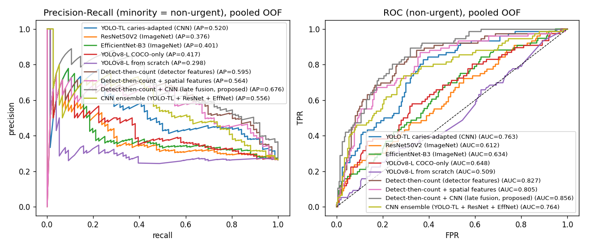
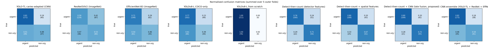

# Leak-free re-analysis — results

## Protocol
- **287 unique patients** (212 urgent / 75 non-urgent, 2.83:1) after removing 5 exact-duplicate images.
- **Nested CV**: 5 patient-level outer folds; hyper-parameters tuned by Optuna (15 trials, macro-F1) on an inner 80/20 hold-out of each outer fold's training data only.
- **Same protocol + same Optuna budget for all three models** (fix #3).
- Mirror/flip applied to training images only; validation & test use original images (fix #4).
- Each outer test fold is evaluated **exactly once**.

## Headline comparison (mean ± sd over 5 folds, %)

| model                                           | macro-F1 (primary)   | F1 non-urgent (minority)   | F1 urgent     | balanced acc   | MCC           | ROC-AUC       | PR-AUC non-urgent   | accuracy      | precision non-urgent   | recall non-urgent   | precision urgent   | recall urgent   |
|:------------------------------------------------|:---------------------|:---------------------------|:--------------|:---------------|:--------------|:--------------|:--------------------|:--------------|:-----------------------|:--------------------|:-------------------|:----------------|
| YOLO-TL caries-adapted (CNN)                    | 62.66 ± 9.66         | 44.25 ± 19.75              | 81.08 ± 3.23  | 65.02 ± 10.90  | 29.91 ± 17.68 | 75.22 ± 11.83 | 54.29 ± 13.77       | 72.49 ± 4.20  | 49.46 ± 13.11          | 49.08 ± 30.71       | 82.65 ± 7.59       | 80.96 ± 10.67   |
| ResNet50V2 (ImageNet)                           | 51.02 ± 8.98         | 38.30 ± 8.41               | 63.74 ± 18.46 | 55.53 ± 7.44   | 12.64 ± 15.43 | 63.66 ± 8.29  | 44.40 ± 2.86        | 57.13 ± 14.63 | 35.55 ± 12.20          | 52.42 ± 27.94       | 78.91 ± 8.41       | 58.65 ± 27.78   |
| EfficientNet-B3 (ImageNet)                      | 55.47 ± 7.29         | 38.01 ± 12.69              | 72.94 ± 12.18 | 58.49 ± 7.97   | 16.48 ± 13.48 | 64.53 ± 10.60 | 42.64 ± 11.90       | 64.07 ± 9.57  | 36.82 ± 6.50           | 46.42 ± 28.19       | 79.45 ± 6.37       | 70.55 ± 20.24   |
| YOLOv8-L COCO-only                              | 57.41 ± 5.14         | 37.80 ± 9.32               | 77.03 ± 5.42  | 57.98 ± 5.10   | 16.70 ± 11.78 | 66.26 ± 4.31  | 48.07 ± 6.01        | 66.92 ± 5.90  | 39.83 ± 13.18          | 39.17 ± 15.39       | 78.06 ± 2.78       | 76.80 ± 11.27   |
| YOLOv8-L from scratch                           | 42.37 ± 0.22         | 0.00 ± 0.00                | 84.74 ± 0.43  | 50.00 ± 0.00   | 0.00 ± 0.00   | 54.79 ± 12.40 | 33.77 ± 7.03        | 73.52 ± 0.65  | 0.00 ± 0.00            | 0.00 ± 0.00         | 73.52 ± 0.65       | 100.00 ± 0.00   |
| Detect-then-count (detector features)           | 70.21 ± 3.22         | 59.08 ± 6.52               | 81.34 ± 2.23  | 73.63 ± 5.57   | 43.67 ± 7.72  | 83.62 ± 5.98  | 65.41 ± 11.25       | 74.57 ± 2.29  | 52.06 ± 4.47           | 71.42 ± 17.09       | 88.53 ± 5.25       | 75.84 ± 7.19    |
| Detect-then-count + spatial features            | 70.29 ± 9.78         | 57.75 ± 17.35              | 82.83 ± 6.26  | 73.69 ± 10.14  | 45.43 ± 15.48 | 82.96 ± 7.63  | 65.73 ± 10.74       | 76.32 ± 6.70  | 56.48 ± 8.92           | 67.75 ± 27.79       | 88.29 ± 7.29       | 79.63 ± 13.18   |
| Detect-then-count + CNN (late fusion, proposed) | 73.61 ± 4.62         | 63.04 ± 7.65               | 84.17 ± 3.48  | 76.43 ± 6.35   | 50.11 ± 8.97  | 86.17 ± 5.44  | 70.61 ± 10.59       | 78.06 ± 3.95  | 58.38 ± 8.52           | 72.75 ± 18.15       | 89.60 ± 5.51       | 80.11 ± 8.63    |
| CNN ensemble (YOLO-TL + ResNet + EffNet)        | 67.01 ± 5.59         | 51.46 ± 11.28              | 82.55 ± 1.18  | 68.11 ± 7.27   | 35.58 ± 10.83 | 76.91 ± 10.45 | 59.11 ± 12.60       | 74.57 ± 1.82  | 51.59 ± 2.45           | 54.25 ± 20.24       | 83.76 ± 5.27       | 81.96 ± 6.05    |

### YOLO-TL caries-adapted (CNN) — per-fold macro-F1
- folds: ['0.540', '0.504', '0.707', '0.691', '0.692']
- mean 0.627 ± 0.097  (95% CI 0.507–0.747)
- confusion (summed): [[171, 40], [39, 37]]  [rows true urgent/non-urgent]

### ResNet50V2 (ImageNet) — per-fold macro-F1
- folds: ['0.623', '0.446', '0.591', '0.455', '0.435']
- mean 0.510 ± 0.090  (95% CI 0.399–0.622)
- confusion (summed): [[124, 87], [36, 40]]  [rows true urgent/non-urgent]

### EfficientNet-B3 (ImageNet) — per-fold macro-F1
- folds: ['0.590', '0.527', '0.527', '0.470', '0.661']
- mean 0.555 ± 0.073  (95% CI 0.464–0.645)
- confusion (summed): [[149, 62], [41, 35]]  [rows true urgent/non-urgent]

### YOLOv8-L COCO-only — per-fold macro-F1
- folds: ['0.555', '0.604', '0.552', '0.646', '0.513']
- mean 0.574 ± 0.051  (95% CI 0.510–0.638)
- confusion (summed): [[162, 49], [46, 30]]  [rows true urgent/non-urgent]

### YOLOv8-L from scratch — per-fold macro-F1
- folds: ['0.426', '0.420', '0.424', '0.424', '0.424']
- mean 0.424 ± 0.002  (95% CI 0.421–0.426)
- confusion (summed): [[211, 0], [76, 0]]  [rows true urgent/non-urgent]

### Detect-then-count (detector features) — per-fold macro-F1
- folds: ['0.678', '0.670', '0.747', '0.724', '0.692']
- mean 0.702 ± 0.032  (95% CI 0.662–0.742)
- confusion (summed): [[160, 51], [22, 54]]  [rows true urgent/non-urgent]

### Detect-then-count + spatial features — per-fold macro-F1
- folds: ['0.718', '0.564', '0.808', '0.773', '0.651']
- mean 0.703 ± 0.098  (95% CI 0.582–0.824)
- confusion (summed): [[168, 43], [25, 51]]  [rows true urgent/non-urgent]

### Detect-then-count + CNN (late fusion, proposed) — per-fold macro-F1
- folds: ['0.693', '0.703', '0.797', '0.773', '0.714']
- mean 0.736 ± 0.046  (95% CI 0.679–0.793)
- confusion (summed): [[169, 42], [21, 55]]  [rows true urgent/non-urgent]

### CNN ensemble (YOLO-TL + ResNet + EffNet) — per-fold macro-F1
- folds: ['0.618', '0.603', '0.723', '0.691', '0.716']
- mean 0.670 ± 0.056  (95% CI 0.601–0.739)
- confusion (summed): [[173, 38], [35, 41]]  [rows true urgent/non-urgent]

