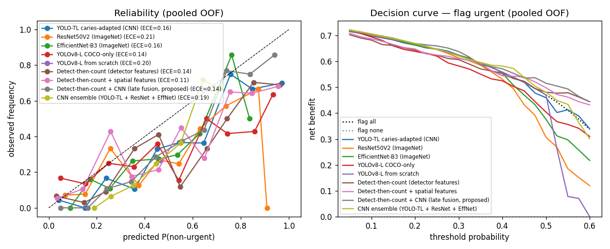

# Supplementary analyses

ROPE = ±1 macro-F1 points · fold-correlation ρ = 0.20

## 1. Bayesian correlated t-test (per-fold differences, proposed − baseline)

### vs YOLO-TL caries-adapted (CNN)

| metric | mean Δ | P(proposed better) | P(equivalent) | P(baseline better) |
|---|---|---|---|---|
| f1_macro | +10.9 | 0.95 | 0.02 | 0.03 |
| f1_non_urgent | +18.8 | 0.94 | 0.01 | 0.05 |
| roc_auc | +11.0 | 0.93 | 0.02 | 0.04 |
| pr_auc_non_urgent | +16.3 | 0.99 | 0.00 | 0.01 |

### vs ResNet50V2 (ImageNet)

| metric | mean Δ | P(proposed better) | P(equivalent) | P(baseline better) |
|---|---|---|---|---|
| f1_macro | +22.6 | 0.99 | 0.00 | 0.01 |
| f1_non_urgent | +24.7 | 0.98 | 0.00 | 0.02 |
| roc_auc | +22.5 | 0.98 | 0.00 | 0.01 |
| pr_auc_non_urgent | +26.2 | 0.98 | 0.00 | 0.01 |

### vs EfficientNet-B3 (ImageNet)

| metric | mean Δ | P(proposed better) | P(equivalent) | P(baseline better) |
|---|---|---|---|---|
| f1_macro | +18.1 | 0.96 | 0.01 | 0.03 |
| f1_non_urgent | +25.0 | 0.97 | 0.01 | 0.02 |
| roc_auc | +21.6 | 0.96 | 0.01 | 0.03 |
| pr_auc_non_urgent | +28.0 | 0.96 | 0.01 | 0.03 |

### vs YOLOv8-L COCO-only

| metric | mean Δ | P(proposed better) | P(equivalent) | P(baseline better) |
|---|---|---|---|---|
| f1_macro | +16.2 | 0.99 | 0.00 | 0.01 |
| f1_non_urgent | +25.2 | 0.97 | 0.01 | 0.02 |
| roc_auc | +19.9 | 1.00 | 0.00 | 0.00 |
| pr_auc_non_urgent | +22.5 | 0.98 | 0.01 | 0.02 |

### vs YOLOv8-L from scratch

| metric | mean Δ | P(proposed better) | P(equivalent) | P(baseline better) |
|---|---|---|---|---|
| f1_macro | +31.2 | 1.00 | 0.00 | 0.00 |
| f1_non_urgent | +63.0 | 1.00 | 0.00 | 0.00 |
| roc_auc | +31.4 | 0.97 | 0.00 | 0.02 |
| pr_auc_non_urgent | +36.8 | 0.98 | 0.00 | 0.01 |

### vs Detect-then-count (detector features)

| metric | mean Δ | P(proposed better) | P(equivalent) | P(baseline better) |
|---|---|---|---|---|
| f1_macro | +3.4 | 0.96 | 0.04 | 0.01 |
| f1_non_urgent | +4.0 | 0.97 | 0.02 | 0.01 |
| roc_auc | +2.6 | 0.86 | 0.12 | 0.02 |
| pr_auc_non_urgent | +5.2 | 0.86 | 0.07 | 0.07 |

### vs Detect-then-count + spatial features

| metric | mean Δ | P(proposed better) | P(equivalent) | P(baseline better) |
|---|---|---|---|---|
| f1_macro | +3.3 | 0.68 | 0.12 | 0.20 |
| f1_non_urgent | +5.3 | 0.69 | 0.07 | 0.23 |
| roc_auc | +3.2 | 0.82 | 0.12 | 0.06 |
| pr_auc_non_urgent | +4.9 | 0.85 | 0.08 | 0.07 |

### vs CNN ensemble (YOLO-TL + ResNet + EffNet)

| metric | mean Δ | P(proposed better) | P(equivalent) | P(baseline better) |
|---|---|---|---|---|
| f1_macro | +6.6 | 0.95 | 0.03 | 0.02 |
| f1_non_urgent | +11.6 | 0.97 | 0.01 | 0.02 |
| roc_auc | +9.3 | 0.91 | 0.03 | 0.06 |
| pr_auc_non_urgent | +11.5 | 0.98 | 0.01 | 0.01 |

## 2. Post-hoc power (paired, α=0.05)

| comparison | metric | effect dz | power @ n=5 | n for 80% power |
|---|---|---|---|---|
| vs YOLO-TL caries-adapted (CNN) | f1_macro | 1.61 | 0.77 | 6 |
| vs YOLO-TL caries-adapted (CNN) | f1_non_urgent | 1.40 | 0.65 | 7 |
| vs YOLO-TL caries-adapted (CNN) | roc_auc | 1.39 | 0.65 | 7 |
| vs YOLO-TL caries-adapted (CNN) | pr_auc_non_urgent | 2.85 | 1.00 | 5 |
| vs ResNet50V2 (ImageNet) | f1_macro | 2.35 | 0.97 | 5 |
| vs ResNet50V2 (ImageNet) | f1_non_urgent | 2.04 | 0.92 | 5 |
| vs ResNet50V2 (ImageNet) | roc_auc | 2.14 | 0.94 | 5 |
| vs ResNet50V2 (ImageNet) | pr_auc_non_urgent | 2.19 | 0.95 | 5 |
| vs EfficientNet-B3 (ImageNet) | f1_macro | 1.70 | 0.81 | 5 |
| vs EfficientNet-B3 (ImageNet) | f1_non_urgent | 1.84 | 0.86 | 5 |
| vs EfficientNet-B3 (ImageNet) | roc_auc | 1.59 | 0.76 | 6 |
| vs EfficientNet-B3 (ImageNet) | pr_auc_non_urgent | 1.64 | 0.78 | 6 |
| vs YOLOv8-L COCO-only | f1_macro | 2.72 | 0.99 | 5 |
| vs YOLOv8-L COCO-only | f1_non_urgent | 1.86 | 0.87 | 5 |
| vs YOLOv8-L COCO-only | roc_auc | 3.81 | 1.00 | 5 |
| vs YOLOv8-L COCO-only | pr_auc_non_urgent | 1.99 | 0.91 | 5 |
| vs YOLOv8-L from scratch | f1_macro | 6.82 | 1.00 | 5 |
| vs YOLOv8-L from scratch | f1_non_urgent | 8.24 | 1.00 | 5 |
| vs YOLOv8-L from scratch | roc_auc | 1.89 | 0.88 | 5 |
| vs YOLOv8-L from scratch | pr_auc_non_urgent | 2.18 | 0.95 | 5 |
| vs Detect-then-count (detector features) | f1_macro | 2.15 | 0.94 | 5 |
| vs Detect-then-count (detector features) | f1_non_urgent | 2.43 | 0.98 | 5 |
| vs Detect-then-count (detector features) | roc_auc | 1.35 | 0.62 | 7 |
| vs Detect-then-count (detector features) | pr_auc_non_urgent | 1.04 | 0.43 | 10 |
| vs Detect-then-count + spatial features | f1_macro | 0.49 | 0.14 | 35 |
| vs Detect-then-count + spatial features | f1_non_urgent | 0.45 | 0.12 | 41 |
| vs Detect-then-count + spatial features | roc_auc | 1.02 | 0.42 | 10 |
| vs Detect-then-count + spatial features | pr_auc_non_urgent | 1.02 | 0.41 | 10 |
| vs CNN ensemble (YOLO-TL + ResNet + EffNet) | f1_macro | 1.69 | 0.80 | 5 |
| vs CNN ensemble (YOLO-TL + ResNet + EffNet) | f1_non_urgent | 2.02 | 0.91 | 5 |
| vs CNN ensemble (YOLO-TL + ResNet + EffNet) | roc_auc | 1.20 | 0.53 | 8 |
| vs CNN ensemble (YOLO-TL + ResNet + EffNet) | pr_auc_non_urgent | 2.26 | 0.96 | 5 |

## 3. Calibration (pooled OOF)

| model | Brier ↓ | ECE ↓ |
|---|---|---|
| YOLO-TL caries-adapted (CNN) | 0.188 | 0.155 |
| ResNet50V2 (ImageNet) | 0.234 | 0.209 |
| EfficientNet-B3 (ImageNet) | 0.212 | 0.164 |
| YOLOv8-L COCO-only | 0.215 | 0.143 |
| YOLOv8-L from scratch | 0.236 | 0.201 |
| Detect-then-count (detector features) | 0.165 | 0.140 |
| Detect-then-count + spatial features | 0.166 | 0.114 |
| Detect-then-count + CNN (late fusion, proposed) | 0.153 | 0.142 |
| CNN ensemble (YOLO-TL + ResNet + EffNet) | 0.195 | 0.190 |

## 4. McNemar (pooled per-patient correctness)

| baseline | proposed-only correct | baseline-only correct | p (exact) |
|---|---|---|---|
| YOLO-TL caries-adapted (CNN) | 39 | 23 | 0.056 |
| ResNet50V2 (ImageNet) | 91 | 31 | 0.000 |
| EfficientNet-B3 (ImageNet) | 67 | 27 | 0.000 |
| YOLOv8-L COCO-only | 64 | 32 | 0.001 |
| YOLOv8-L from scratch | 55 | 42 | 0.223 |
| Detect-then-count (detector features) | 13 | 3 | 0.021 |
| Detect-then-count + spatial features | 16 | 11 | 0.442 |
| CNN ensemble (YOLO-TL + ResNet + EffNet) | 36 | 26 | 0.253 |

## 5. Subgroup robustness by source dataset

| model | source | n | macro-F1 | ROC-AUC |
|---|---|---|---|---|
| YOLO-TL caries-adapted (CNN) | A | 123 | 0.607 | 0.717 |
| YOLO-TL caries-adapted (CNN) | B | 164 | 0.680 | 0.804 |
| ResNet50V2 (ImageNet) | A | 123 | 0.551 | 0.627 |
| ResNet50V2 (ImageNet) | B | 164 | 0.516 | 0.604 |
| EfficientNet-B3 (ImageNet) | A | 123 | 0.654 | 0.692 |
| EfficientNet-B3 (ImageNet) | B | 164 | 0.516 | 0.584 |
| YOLOv8-L COCO-only | A | 123 | 0.620 | 0.702 |
| YOLOv8-L COCO-only | B | 164 | 0.551 | 0.615 |
| YOLOv8-L from scratch | A | 123 | 0.417 | 0.494 |
| YOLOv8-L from scratch | B | 164 | 0.429 | 0.523 |
| Detect-then-count (detector features) | A | 123 | 0.736 | 0.842 |
| Detect-then-count (detector features) | B | 164 | 0.680 | 0.812 |
| Detect-then-count + spatial features | A | 123 | 0.745 | 0.818 |
| Detect-then-count + spatial features | B | 164 | 0.692 | 0.790 |
| Detect-then-count + CNN (late fusion, proposed) | A | 123 | 0.756 | 0.853 |
| Detect-then-count + CNN (late fusion, proposed) | B | 164 | 0.726 | 0.859 |
| CNN ensemble (YOLO-TL + ResNet + EffNet) | A | 123 | 0.655 | 0.777 |
| CNN ensemble (YOLO-TL + ResNet + EffNet) | B | 164 | 0.694 | 0.763 |

## 6. Trivial baselines (context)

| strategy | macro-F1 | F1 non-urgent | accuracy |
|---|---|---|---|
| always_urgent | 42.4 | 0.0 | 73.5 |
| always_non_urgent | 20.9 | 41.9 | 26.5 |
| random_50_50 | 49.6 | 36.6 | 53.0 |
| stratified_prior | 52.3 | 31.2 | 61.7 |

  — reliability diagram + decision curve