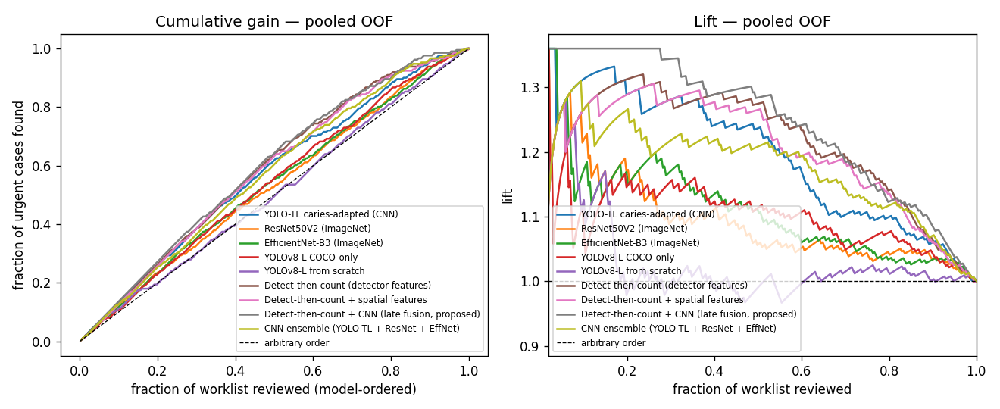

# Worklist-prioritisation: cumulative gain & lift

If radiographs are reviewed in model-predicted-urgency order (pooled OOF, n=287, 211 urgent):

| model | urgent found in top 10% (lift) | top 20% (lift) | top 30% (lift) | top 50% (lift) |
|---|---|---|---|---|
| YOLO-TL caries-adapted (CNN) | 13% (1.31×) | 26% (1.29×) | 38% (1.28×) | 62% (1.24×) |
| ResNet50V2 (ImageNet) | 12% (1.22×) | 23% (1.17×) | 33% (1.09×) | 53% (1.06×) |
| EfficientNet-B3 (ImageNet) | 12% (1.17×) | 23% (1.17×) | 35% (1.17×) | 55% (1.11×) |
| YOLOv8-L COCO-only | 11% (1.08×) | 23% (1.15×) | 35% (1.15×) | 56% (1.11×) |
| YOLOv8-L from scratch | 11% (1.13×) | 19% (0.98×) | 30% (1.00×) | 50% (0.99×) |
| Detect-then-count (detector features) | 13% (1.27×) | 26% (1.31×) | 38% (1.28×) | 64% (1.28×) |
| Detect-then-count + spatial features | 13% (1.27×) | 26% (1.29×) | 38% (1.28×) | 64% (1.27×) |
| Detect-then-count + CNN (late fusion, proposed) | 14% (1.36×) | 27% (1.36×) | 40% (1.34×) | 64% (1.28×) |
| CNN ensemble (YOLO-TL + ResNet + EffNet) | 13% (1.27×) | 25% (1.26×) | 36% (1.22×) | 61% (1.21×) |

## Number needed to review (model-ordered) to find …

| model | 50% of urgent | 80% of urgent | 95% of urgent |
|---|---|---|---|
| YOLO-TL caries-adapted (CNN) | 116 (40%) | 208 (72%) | 258 (90%) |
| ResNet50V2 (ImageNet) | 133 (46%) | 222 (77%) | 265 (92%) |
| EfficientNet-B3 (ImageNet) | 129 (45%) | 220 (77%) | 264 (92%) |
| YOLOv8-L COCO-only | 128 (45%) | 216 (75%) | 265 (92%) |
| YOLOv8-L from scratch | 145 (51%) | 226 (79%) | 273 (95%) |
| Detect-then-count (detector features) | 112 (39%) | 192 (67%) | 256 (89%) |
| Detect-then-count + spatial features | 113 (39%) | 194 (68%) | 257 (90%) |
| Detect-then-count + CNN (late fusion, proposed) | 112 (39%) | 190 (66%) | 245 (85%) |
| CNN ensemble (YOLO-TL + ResNet + EffNet) | 119 (41%) | 201 (70%) | 252 (88%) |

Arbitrary order finds ~X% of urgent cases after reviewing X% of the worklist (lift = 1.0). Base urgent rate = 74%.

